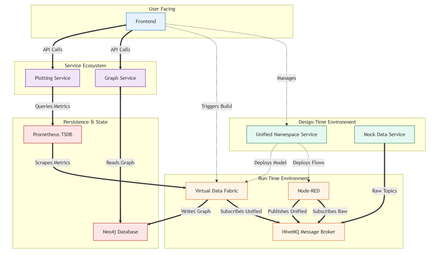

# DataVision-AI

An extensible, microservices-based platform designed to solve a common, complex problem in the IoT world: **transforming raw, chaotic, and device-centric data streams into a structured, queryable, and real-time knowledge graph.**

This project provides a complete end-to-end workflow for modeling a physical environment, unifying disparate data sources, deploying a live data pipeline, and visualizing the results in a powerful, interactive interface.

## System Architecture

The platform's architecture is fundamentally divided into a **Design-Time Environment** (where you model your system) and a **Run-Time Environment** (where the live data pipeline is executed). This separation of concerns ensures a modular, resilient, and understandable system.



## Core Concepts

- **The Unified Namespace (UNS):** The central principle of the platform. The system's primary goal is to transform messy, device-centric topics like `HumiditySensorConferenceRoom/events/humidity` into clean, contextual topics like `my_smart_office/floor_1/conference_room/humidity`.
- **Design-Time vs. Run-Time:** You first use the Design-Time environment (the Frontend and the Unified Namespace Service) to model your system. Then, you deploy that model to the Run-Time environment, which executes the live data pipeline.
- **Extensible Microservices:** The entire platform is a collection of small, focused services, each highly specialized in a specific task (graph service, plotting service).

## Features

- **Model-Driven Configuration:** Visually build a hierarchy of your physical environment (buildings, floors, rooms) and assign data sources to them.
- **Automatic Flow Generation:** The platform automatically "compiles" your model into executable Node-RED data transformation flows.
- **Interactive Knowledge Graph:** Visualize your entire system's structure and relationships in a dynamic graph powered by Neo4j.
- **Live Data Plotting:** Click on any entity in the knowledge graph (a room, a floor) to see live, updating plots of all associated sensor data.
- **Developer-Friendly Inspection Tools:** Includes web UIs for Node-RED, HiveMQ, Prometheus, Grafana, and Neo4j for deep system inspection.
- **Extensible by Design:** The Backend-for-Frontend (BFF) pattern makes it easy to add new data sources or APIs without modifying the core system.

## Technology Stack

| Component                | Technology                              |
| ------------------------ | --------------------------------------- |
| **Frontend**             | Angular, Bootstrap, ngx-graph, Chart.js |
| **Backend APIs**         | Python (Flask)                          |
| **Data Transformation**  | Node-RED                                |
| **Message Broker**       | HiveMQ (MQTT)                           |
| **Knowledge Graph**      | Neo4j                                   |
| **Time-Series Database** | Prometheus                              |
| **Visualization**        | Grafana                                 |
| **Device Simulation**    | Node.js (Web of Things)                 |
| **Orchestration**        | Docker & Docker Compose                 |

## Getting Started

Follow these instructions to get the entire platform running on your local machine.

### Prerequisites

To run this project, you will need the following software installed:

- **Git:** To clone the repository.
- **Docker & Docker Compose:** To build and run the containerized services.

### Installation and Startup

1.  **Clone the Repository**

    Open your terminal and clone the project to your local machine:

    ```bash
    git clone https://github.com/DataVision-AI/system-design.git
    cd system-design
    ```

2.  **Start the System**

    Use Docker Compose to build and start all the services. The `-d` flag runs the containers in "detached" mode (in the background).

    ```bash
    docker-compose up -d --build
    ```

    > **Note:** The very first time you run this command, it will download all necessary Docker images (Python, Node.js, Neo4j, etc.) and build the custom service images. This can take several minutes. Subsequent startups will be much faster.

## Your First Workflow: A Guided Tour

Once all services are running, you can interact with the platform. The entire workflow is managed through the main frontend application.

1.  **Access the Frontend**

    Open your web browser and navigate to: **[http://localhost:4200](http://localhost:4200)**

2.  **Register Your Things**

    Navigate to the **Things List** tab. This is where you register the raw data sources. The system is pre-loaded with sample data, but you can add or remove "Things" here to define the inputs for your pipeline.

3.  **Model Your Environment**

    Navigate to the **Building Structure** tab. Here, you can visually construct a hierarchy of buildings, floors, and rooms. Within each room, use the **+ Thing** button to assign the devices you registered. This is where you give your raw data its physical context. Save your changes when you are done.

4.  **Deploy the Pipeline**

    This is a two-part step that "compiles" your model into a live pipeline.
    a) Go to the **Node Red Management** tab and click **Generate Node-RED**. This instructs the Unified Namespace Service to create and deploy the data transformation flows.
    b) On the same tab, click **Export to Virtual Data Fabric**. Then, navigate to the **Virtual Data Fabric** tab and click the final **Build Virtual Data Fabric** button. This activates the run-time engine.

5.  **Visualize the Result**

    Navigate to the **Knowledge Graph** tab. You will now see a complete, interactive visualization of your system. Click on any node in the graph (e.g., a Room or a Floor) to see live-updating plots of all the sensor data associated with it.

    Congratulations, you have a fully operational data fabric!

## Exploring the System (Developer's View)

The platform exposes several UIs for monitoring, debugging, and administration:

| Service                   | URL                     | Credentials          | Purpose                                               |
| ------------------------- | ----------------------- | -------------------- | ----------------------------------------------------- |
| **Main Frontend**         | `http://localhost:4200` | -                    | Primary user interface for configuration & monitoring |
| **Node-RED Editor**       | `http://localhost:1880` | -                    | View and debug the live data transformation flows     |
| **HiveMQ Control Center** | `http://localhost:8080` | `admin` / `hivemq`   | Monitor MQTT clients and message traffic              |
| **Prometheus UI**         | `http://localhost:9090` | -                    | Query the raw time-series metrics                     |
| **Grafana**               | `http://localhost:3000` | `admin` / `admin`    | Create custom dashboards and visualizations           |
| **Neo4j Browser**         | `http://localhost:7474` | `neo4j` / `password` | Visually explore the knowledge graph database         |

## Stopping the System

When you are finished, you can stop all the running services with a single command from the project's root directory:

```bash
docker-compose down
```

To stop the services AND remove the persistent data volumes (e.g., the Node-RED flows and Grafana configurations), use the `-v` flag. This is useful if you want to ensure a completely clean start next time.

```bash
docker-compose down -v
```

## Architecture Overview

The system is composed of the following microservices:

- **`frontend`**: The Angular single-page application that provides the main user interface.
- **`unified-namespace-service`**: The "brain" of the design-time environment; manages models and generates flows.
- **`virtual-data-fabric`**: The run-time orchestrator; populates the databases and serves metrics.
- **`mock-things`**: A Web of Things device simulator that generates realistic sensor data.
- **`hivemq`**: The central MQTT message broker for all real-time communication.
- **`node-red`**: The data transformation engine that executes the generated flows.
- **`neo4j`**: The graph database that stores the system's structural model.
- **`prometheus`**: The time-series database for historical sensor data.
- **`grafana`**: The dashboarding and visualization platform.
- **`graph-service`**: A dedicated backend API (BFF) for querying the Neo4j database.
- **`plotting-service`**: A dedicated backend API (BFF) for querying the Prometheus database.

For a detailed breakdown of each service and their interactions, please see the extended [documentation](https://datavision-ai.github.io/Documentation/#/).
